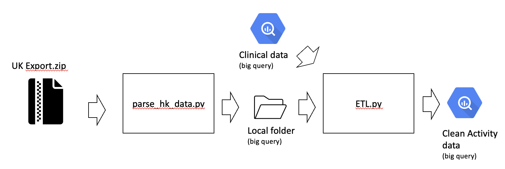

# Data Parser

A Python submodule for parsing MHC data and cleaning it.

## Description

This script is designed to parse data Apple HK data from local files and clean it for use. It provides a flexible and customizable way to extract, transform, and load data.



There are two main files: 
- parse_hk_data.py - this file copies the data from the original file into aggregated files by patient aggregating them by day
- ETL.py - this script performs transformations on the data including cleaning operations - the imputation information has been censored for now.

## Features

- Data extraction from CSV and JSON
- Data transformation using custom rules and functions
- Data loading into Google BigQuery
- Error handling and logging for data parsing process - incomplete

## Authors

- Dr Juan Antonio Delgado San Martin
- Dr Juan Jose Giraldo Gutierrez

## Installation

1. Clone the repository:

    ```shell
    git clone https://github.com/jadsm/imperial-mhc-parsers.git
    ```

2. Set up environment & install dependencies (conda example):

    ```shell
    conda create -n myenv python==3.11.7

    pip install -r requirements.txt
    ```

3. Run the scripts (currently need to be run manually)

        Note: paths need to be manually adjusted
        Note: please ignore dfm (clinical data) for now
